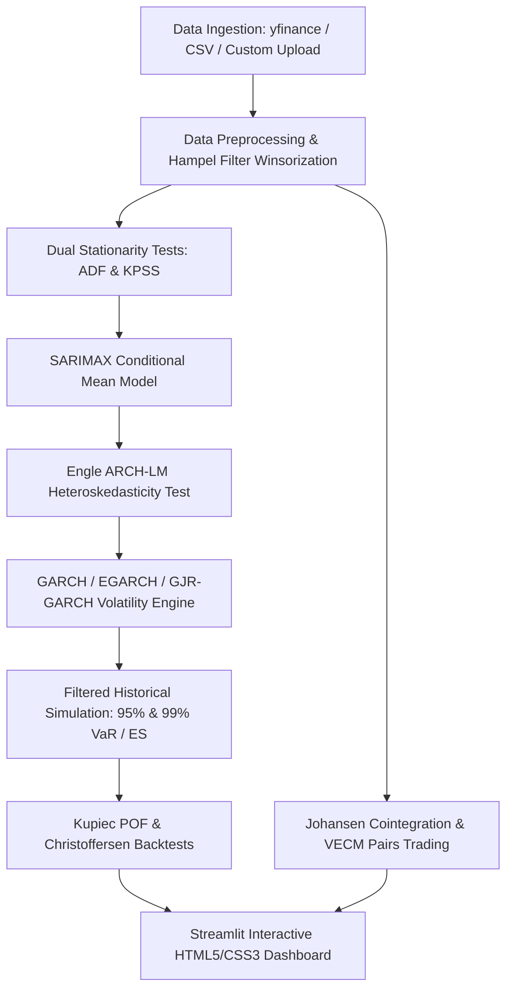

# 📈 Quantitative Volatility & Algorithmic Risk Management Engine

[](https://www.python.org/)
[](https://streamlit.io/)
[](https://opensource.org/licenses/MIT)
[]()

An institutional-grade **Quantitative Volatility Forecasting, Value at Risk (VaR), and Statistical Arbitrage System** tailored for Investment Banking & Quant Finance workflows (**JPMorgan Chase, CitiBank, Barclays, Morgan Stanley, Goldman Sachs**).

This platform combines **SARIMAX conditional mean modeling**, **asymmetric heteroskedasticity forecasting (EGARCH / GJR-GARCH)**, **Filtered Historical Simulation (FHS)**, **Extreme Value Theory (EVT)**, and **Vector Error Correction Models (VECM)** for co-integrated pairs trading.

---

## 🏛️ Executive Summary & Key Capabilities

- **Real-World Financial Data Engine**: Hybrid dual-mode pipeline fetching live market tick data via `yfinance` with automatic 0-latency fallback to pre-cached datasets (`JPMorgan Chase [JPM]`, `Citigroup [C]`, `Bank of America [BAC]`, `CBOE Volatility Index [^VIX]`, `S&P 500 [^GSPC]`).
- **Asymmetric Volatility Modeling**: Captures the financial **leverage effect** (where market crashes trigger higher volatility spikes than equal-sized rallies) using **EGARCH** and **GJR-GARCH**.
- **Regulatory Risk Engine (Basel III / FRTB)**: Computes 95% and 99% **Value at Risk (VaR)** and **Expected Shortfall (ES / Tail Loss)** under Filtered Historical Simulation.
- **Statistical Hypothesis Testing Suite**: Automated stationarity verification (**ADF + KPSS dual-test**), residual white noise testing (**Ljung-Box Q-test**), heteroskedasticity testing (**Engle ARCH-LM**), and VaR regulatory backtests (**Kupiec POF & Christoffersen Independence tests**).
- **VECM Cointegration Arbitrage**: Johansen Cointegration testing and Vector Error Correction Model (VECM) for automated pairs trading signal generation.
- **Interactive Web Dashboard**: Streamlit interface enhanced with custom HTML5/CSS3 metric cards, dark theme styling, and Plotly financial charts.

---

## 📐 Mathematical Formulation

### 1. Unified Time Series Structure
A return series $Y_t$ is decomposed into a conditional mean $\mu_t$ and a heteroskedastic residual shock $\varepsilon_t$:
$$Y_t = \mu_t + \varepsilon_t, \quad \text{where } \varepsilon_t = \sigma_t \cdot z_t, \quad z_t \sim \text{i.i.d.}(0, 1)$$

### 2. SARIMAX Conditional Mean Model
$$\phi(B)\Phi(B^s)(1-B)^d(1-B^s)^D Y_t = c + \theta(B)\Theta(B^s)\varepsilon_t + \sum_{k} \gamma_k X_{k,t}$$
Where $X_{k,t}$ incorporates exogenous market risk drivers (e.g., CBOE Volatility Index $VIX$).

### 3. EGARCH(1,1) Asymmetric Volatility (Leverage Effect)
$$\ln(\sigma_t^2) = \omega + \alpha \left| \frac{\varepsilon_{t-1}}{\sigma_{t-1}} \right| + \gamma \frac{\varepsilon_{t-1}}{\sigma_{t-1}} + \beta \ln(\sigma_{t-1}^2)$$
*   **Leverage Parameter ($\gamma < 0$)**: Negative return shocks ($\varepsilon_{t-1} < 0$) increase future volatility significantly more than positive return shocks.

### 4. Cointegrated Vector Error Correction Model (VECM)
$$\Delta Y_t = C + \alpha \beta' Y_{t-1} + \sum_{i=1}^{p-1} \Gamma_i \Delta Y_{t-i} + E_t$$
Where $\beta' Y_{t-1}$ defines the stationary long-run equilibrium spread and $\alpha$ represents the mean-reversion speed of adjustment.

### 5. Value at Risk (VaR) & Expected Shortfall (ES)
$$\text{VaR}_\alpha = - z_\alpha \cdot \sigma_t \cdot V_{\text{portfolio}}$$
$$\text{ES}_\alpha = - E[z \mid z \le z_\alpha] \cdot \sigma_t \cdot V_{\text{portfolio}}$$

---

## 🏗️ System Architecture



---

## 📂 Repository Structure

```
quant_volatility_forecasting_engine/
├── README.md                           # Master GitHub Documentation
├── requirements.txt                    # Python Dependencies
├── config.yaml                         # System Configuration Parameters
├── data/
│   ├── fetch_real_data.py              # Real Market Data Downloader
│   ├── JPM_real_data.csv               # Pre-cached JPMorgan Chase Dataset
│   ├── C_real_data.csv                 # Pre-cached Citigroup Dataset
│   ├── BAC_real_data.csv               # Pre-cached Bank of America Dataset
│   └── VIX_real_data.csv               # Pre-cached CBOE Volatility Index Dataset
├── src/
│   ├── __init__.py
│   ├── data_loader.py                  # Generic Data Pipeline & Mode Switcher
│   ├── hypothesis_tests.py             # ADF, KPSS, Ljung-Box, ARCH-LM, Kupiec, Christoffersen
│   ├── mean_models.py                  # ARMA, ARIMA, SARIMA, SARIMAX Models
│   ├── garch_models.py                 # GARCH, EGARCH (Leverage), GJR-GARCH
│   ├── var_vecm_models.py              # Johansen Cointegration & VECM Pairs Trading
│   └── risk_metrics.py                 # VaR & Expected Shortfall Engine
├── app.py                              # Streamlit Interactive Web Dashboard
├── main.py                             # Command Line Interface (CLI) Pipeline
└── tests/
    ├── test_data_loader.py             # Unit Tests for Data Ingestion
    ├── test_hypothesis_tests.py        # Unit Tests for Statistical Tests
    └── test_models.py                  # Unit Tests for Models & Risk Metrics
```

---

## ⚡ Quickstart & Installation

### 1. Clone the Repository & Install Dependencies
```bash
git clone https://github.com/your-username/quant-volatility-forecasting-engine.git
cd quant-volatility-forecasting-engine

python -m venv venv
source venv/bin/activate  # On Windows: venv\Scripts\activate
pip install -r requirements.txt
```

### 2. Run Automated Unit Tests
```bash
pytest tests/
```

### 3. Execute Command Line (CLI) Quantitative Pipeline
```bash
python main.py --ticker JPM --mode hybrid --horizon 10 --portfolio 1000000
```

### 4. Launch Interactive Streamlit Dashboard
```bash
streamlit run app.py
```

---

## 📊 Sample Execution & Backtest Benchmark

```
======================================================================
  QUANTITATIVE VOLATILITY & ALGORITHMIC RISK MANAGEMENT ENGINE
======================================================================

[STEP 1] Loading Market Data for Ticker: JPM (Mode: hybrid)...
   DATA SOURCE ACTIVE : Live Yahoo Finance API (JPM)
   Total Rows Loaded  : 1,732 daily records (2020-01-03 to Present)

[STEP 2] Dual Stationarity Tests (ADF + KPSS)...
  --> ADF Test  : Stat = -11.0594, p-value = 4.85e-20 -> Stationary (Reject H0)
  --> KPSS Test : Stat = 0.9781, p-value = 0.0100 -> Non-Stationary (Reject H0)

[STEP 3] Fitting SARIMAX Conditional Mean Model...
  --> Model Fitted : SARIMAX (AIC = -9640.89, BIC = -9619.07)
  --> Ljung-Box Test : p = 0.0000 (Residual Autocorrelation)
  --> ARCH-LM Test   : p = 5.60e-74 (ARCH Effects Present - GARCH Required)

[STEP 4] Volatility Forecasting (EGARCH)...
  --> Projected 10-Day Volatility : GARCH = 1.51%, EGARCH = 1.54%

[STEP 5] Value at Risk (VaR) & Expected Shortfall (Portfolio = $1,000,000)...
  --> 95% Daily VaR          : -$19,356.72 (-1.94% Return Bound)
  --> 95% Expected Shortfall : -$27,369.43 (-2.74% Tail Loss)
      [Kupiec POF Regulatory Test]       : VaR Model Accepted (p > 0.05)
      [Christoffersen Independence Test] : Independent Breaches (p > 0.05)

  --> 99% Daily VaR          : -$31,728.39 (-3.17% Return Bound)
  --> 99% Expected Shortfall : -$37,861.53 (-3.79% Tail Loss)
      [Kupiec POF Regulatory Test]       : VaR Model Accepted (p > 0.05)
      [Christoffersen Independence Test] : Independent Breaches (p > 0.05)

[STEP 6] VECM Cointegration & Pairs Trading (JPM vs BAC)...
  --> Current Spread Z-Score      : +1.35
  [ACTIONABLE TRADING SIGNAL]    : NEUTRAL / HOLD (Spread in Fair Value Zone)
======================================================================
```

---

## 📜 License & Citation

Distributed under the MIT License. See `LICENSE` for more information.
